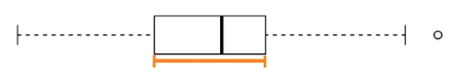
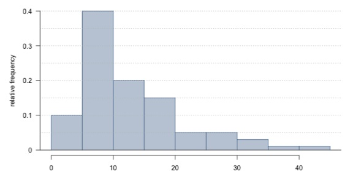
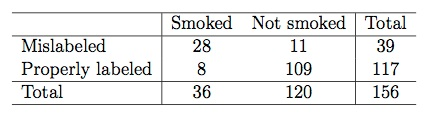
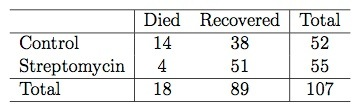
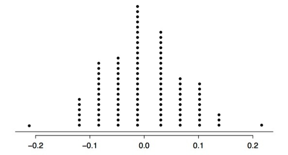

## Week 2 Practice Quiz
### Question 1: Which of the below data sets has the lowest standard deviation? You do not need to calculate the exact standard deviations to answer this question.
* 0, 1, 2, 3, 4, 5, 6
* 0, 1, 3, 3, 3, 5, 6
* __100, 100, 100, 100, 100, 100, 101__
* 0, 25, 50, 100, 125, 150, 1000

### Question 2: __True or False:__ The statistic mean/median (mean divided by median) can be used as a measure of skewness (either right or left). Suppose we are dealing with a distribution where the minimum is 0.5. If this statistic is less than 1, the distribution is most likely left skewed.
* True
* False

### Question 3: __True or False__: You are going to collect income data from a right-skewed distribution of incomes of politicians. If you take a large enough sample from that distribution, the sample mean and the sample median will always have the same value.
* True
* __False__

### Question 4: __True or False__: A mosaic plot is useful for visualizing the relationship between a numerical and a categorical variable.
* True
* __False__

### Question 5: Does meditation cure insomnia? Researchers randomly divided 400 people into two equal- sized groups. One group meditated daily for 30 minutes, the other group attended a 2-hour information session on insomnia. At the beginning of the study, the average difference between the number of minutes slept between the two groups was about 0. After the study, the average difference was about 32 minutes, and the meditation group had a higher average number of minutes slept. To test whether an average difference of 32 minutes could be attributed to chance, a statistics student decided to conduct a randomization test. She wrote the number of minutes slept by each subject in the study on an index card. She shuffled the cards together very well, and then dealt them into two equal-sized groups. Which of the following best describes the outcome?

* If meditation is effective, the average difference between the two stacks of cards will be more than 32 minutes.
* The average difference between the two stacks of cards will be about 32 minutes.
* __The average difference between the two stacks of cards will be about 0 minutes.__

## Week 2 Quiz
### Question 1: 
Which of the following is the width of the box in a box plot (shown in orange in the following figure)?
 

* mean
* standard deviation
* __IQR__
* range
* median

### Question 2: The distribution of housing prices in a country where 25% of the houses cost below $350,000, 50% of the houses cost below $450,000, 75% of the houses cost below $1,000,000 and there are a meaningful number of houses that cost more than $6,000,000 is most likely
* left skewed
* __right skewed__
* symmetric
* uniform

### Question 3: Based on the relative frequency histogram below, which of the following statements is supported by the plot?


* The mean of the distribution is smaller than its median.
* The distribution is multimodal.
* It is not possible to estimate the median without knowing the sample size.
* There are no outliers in the distribution
* __The IQR of the distribution is roughly 10__

### Question 4: A recent housing survey was conducted to determine the price of a typical home in a city that is mostly middle-class, with one very expensive suburb. The mean price of a house in this city is roughly $650,000. Which of the following statements is most likely to be true?
* There are about as many houses in this city that cost more than $650,000 than less than this amount.
* We need to know the standard deviation to answer this question
* Majority of houses in this city cost more than $650,000.
* __Majority of houses in this city cost less than $650,000.__

### Question 5: It is relatively common for fish to be mislabeled in supermarkets and even in restaurants. The table below shows the results of a study where a random sample of 156 fish for sale were collected and genetically tested. The researchers classified each sample as being labeled properly or being mislabeled. What fraction of smoked fish in the sample were mislabeled? Choose the closest answer.


* __78%__
* 9%
* 28%
* 18%
* 72%

### Question 6: In 1948, Austin Bradford Hill, designed a study to test a new treatment for tuberculosis that at the beginning of the study there was no evidence whether it would be any better or worse than bed rest. He randomly assigned some patients who volunteered to be a part of this study to receive the treatment Streptomycin, an antibiotic. The other patients received only bed rest as the control group. Hill then observed the patients' outcomes: which patients died and which recovered. The results of the study are shown below.


We use the following simulation test if there is a difference between the recovery rates under the two treatments: We write "died" on 18 index cards and "survived" on 89 index cards to indicate whether or not a patient died. Next, we shuffle the cards and deal them into two groups of 52 and 55, for control and treatment, respectively. We then calculate the simulated difference between the recovery rates in Streptomycin and control groups (p^Streptomycin ??? p^Control), and record this value. We repeat this simulation 100 times. The histogram below shows the distribution simulated difference between the recovery rates in these 100 simulations.


Which of the following is correct? Choose all that apply (there are multiple correct answers).

* __Streptomycin treatment appears to be effective in treating tuberculosis since the observed difference in recovery rates would be considered unusual based on the simulation results.__
```{r}
# observed difference in recovery rates
(51/55)-(38/52)
```
* Hill's study is observational.
* __If Streptomycin and bed rest are equally effective in curing tuberculosis, the probability of observing a difference in the recovery rates at least as high as the one observed is 2%.__
```{r}
# There is one simulation where the simulated difference is greater than observed difference.
# The p-value is
.01*2
```
* The alternative hypothesis is that the Streptomycin treatment is more effective than bed rest.
* Streptomycin treatment does not appear to be effective in treating tuberculosis since the observed number of deaths in the treatment group would not be considered unusual based on the simulation results.
* The conclusion of this study is generalizable to all tuberculosis patients.
* __The alternative hypothesis should be that there is a difference between the recovery rates under the two treatments.__
* The difference between the survival rates in the control and treatment groups appear to be simply due to chance.
* __Based on this study we can conclude a causal relationship between Streptomycin and better tuberculosis recovery rate.__