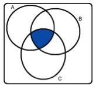
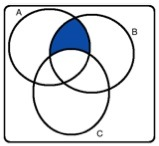
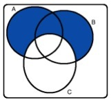
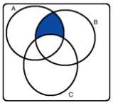
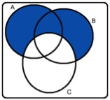
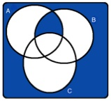
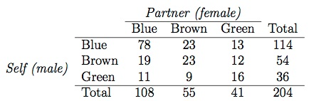

## Practice Quiz

### Question 1: 
Shown below are four Venn diagrams. In which of the diagrams does the shaded 
area represent A and B and C?  
A:  
B: 
C: 
D: 

* __A__
* B
* C
* D

### Question 2: 
Which of the following is false about probability distributions

* Each probability should be greater than or equal to 0.
* __The outcomes listed must be independent.__
* The probabilities must total 1.
* Each probability should be less than or equal to 1.

### Question 3: 
Last semester, out of 170 students taking a particular statistics class, 71 
students were "majoring" in social sciences and 53 students were majoring in 
pre-medical studies. There were 6 students who were majoring in both pre-medical
studies and social sciences. What is the probability that a randomly chosen 
student is majoring in social sciences, given that s/he is majoring in 
pre-medical studies?

* 6/170
* __6/53__
* 6/71
* (71+53-6)/170

## Graded Quiz

### Question 1: 
Which of the following states that the proportion of occurrences with a 
particular outcome converges to the probability of that outcome?

* General addition rule
* Bayes' theorem
* Law of averages
* __Law of large numbers__

### Question 2: 
Shown below are four Venn diagrams. In which of the diagrams does the shaded 
area represent A or B but not C?

A:  
B: 
C: 
D: 

* A
* B
* __C__
* D

### Question 3: 
Each choice below shows a suggested probability distribution for the method of 
access to online course materials (desktop computer, laptop computer, tablet, 
smartphone). Determine which is a proper probability distribution.

* __desktop computer: 0.25, laptop computer: 0.35, tablet: 0.15, smartphone: 0.25__
* desktop computer: 0.15, laptop computer: 0.50, tablet: 0.30, smartphone: 0.20
* desktop computer: 0.20, laptop computer: 0.20, tablet: 0.20, smartphone: 0.20
* desktop computer: 0.30, laptop computer: 0.40, tablet: 0.35, smartphone: -0.05

### Question 4: 
Assortative mating is a nonrandom mating pattern where individuals with similar 
genotypes and/or phenotypes mate with one another more frequently than what 
would be expected under a random mating pattern. Researchers studying this topic
collected data on eye colors of 204 Scandinavian men and their female partners. 
The table below summarizes the results. For simplicity, assume heterosexual 
relationships. What is the probability that a randomly chosen couple is 
comprised of a male and female with blue eyes?

* 78/114
* 78/108
* (108+114-78)/204
* __78/204__

### Question 5: 
Which of the following is false?

* __If two events (both with probability greater than 0) are mutually exclusive, 
they could be independent.__
* When computing the probability that a card drawn randomly from a standard
deck is either a Jack or a 4, you can use the addition rule.
* If two outcomes of a random process (both with probability greater than 0) are
mutually exclusive, they are not necessarily complements.
* If the probabilities of two mutually exclusive outcomes of a random process 
add up to 1, they are complements.
